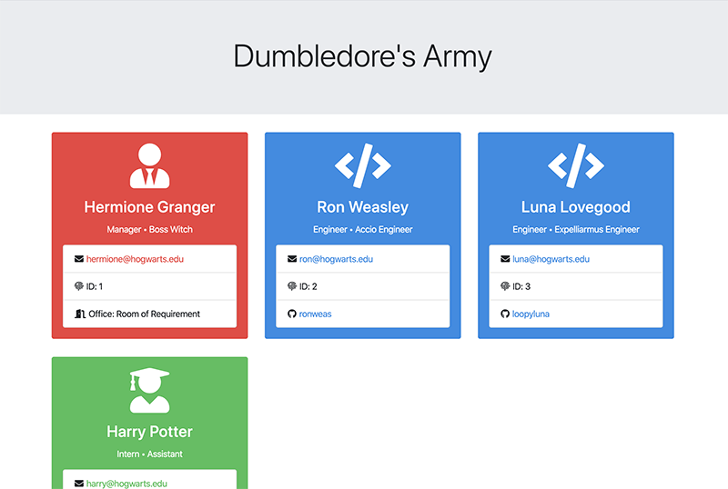

# Development Team Summary Generator

## Summary
This CLI application takes user input about a development team and produces a team summary from that input. Users are prompted to enter a team name, and then enter as many team members (one manager and unlimited engineers and interns) as they desire. Once the user is done entering team members, the app will generate an HTML file with a summary of the whole team.

## Prerequisites
* [NodeJS](https://nodejs.org/)

## Installing

Clone the repository to your local development environment.

```
git clone https://github.com/amandalatkins/team-summary-generator.git
```

Navigate to the team-summary-generator folder.

Run `npm install` to install all dependencies.

## Using the Application

```
node app.js
```

### HTML Output Preview:


## Code Snippets

The following code snippet shows how this application uses classes to maintain uniformity when adding new team members

```
function createEmployee(answers, type) {

    if (type === "Manager") {
        let manager = new Manager(answers.name,answers.title,answers.email,answers.other);
        team.manager = manager;
    } else if (type === "Intern") {
        let intern = new Intern(answers.name,answers.title,answers.email,answers.other);
        team.interns.push(intern);
    } else if (type === "Engineer") {
        let engineer = new Engineer(answers.name,answers.title,answers.email,answers.other);
        team.engineers.push(engineer);
    }

    console.log(`Added ${type} ${answers.name} to ${teamName}`);

    askAddNewEmployee();
    
}
```

The following code snippet shows how this application populates the HTML templates with data supplied by the user. Each template has unique strings of characters that are replaced using `.replace()`

```
// This function renders the PDF using electron-html-to
function populateTemplate(main, html, details) {
    var templateReplacements = [];
    if (!main) {
        templateReplacements = [
            {
                find: "zzzEmployeeNamezzz",
                replace: details.getName()
            },
            {
                find: "zzzEmployeeRolezzz",
                replace: details.getRole()
            },
            {
                find: "zzzEmployeeTitlezzz",
                replace: details.getTitle()
            },
            {
                find: "zzzEmployeeIdzzz",
                replace: details.getId()
            },
            {
                find: "zzzEmployeeEmailzzz",
                replace: details.getEmail()
            }
        ]

        if (details.getRole() === "Manager") {
            templateReplacements.push({
                find: "zzzEmployeeOfficezzz",
                replace: details.getOfficeNumber()
            });
        } else if (details.getRole() === "Engineer") {
            templateReplacements.push({
                find: "zzzEmployeeGithubzzz",
                replace: details.getGithub()
            });
        } else if (details.getRole() === "Intern") {
            templateReplacements.push({
                find: "zzzEmployeeSchoolzzz",
                replace: details.getSchool()
            });
        }
    } else {
        templateReplacements = [{
            find: "zzzTeamNamezzz",
            replace: teamName
        },{
            find: "zzzTeamSummaryzzz",
            replace: details
        }]
    }

    templateReplacements.forEach(filter => {
        var regex = new RegExp(filter.find, "g");
        html = html.replace(regex, filter.replace);
    });

    return html;

}
```

## Built With
* [JavaScript](https://developer.mozilla.org/en-US/docs/Web/JavaScript)
* [NodeJS](https://nodejs.org)
* [Bootstrap](https://getbootstrap.com)
* [Test Driven Development](https://www.freecodecamp.org/news/test-driven-development-what-it-is-and-what-it-is-not-41fa6bca02a2/)
* Node Packages:
    * [Inquirer](https://www.npmjs.com/package/inquirer)
    * [Jest](https://www.npmjs.com/package/jest)

## Authors
Amanda Atkins
* [Portfolio](https://digitalrainstorm.com/)
* [GitHub](https://github.com/amandalatkins)
* [LinkedIn](https://www.linkedin.com/in/amandalatkins)

## License
This project is licensed under the ISC License.